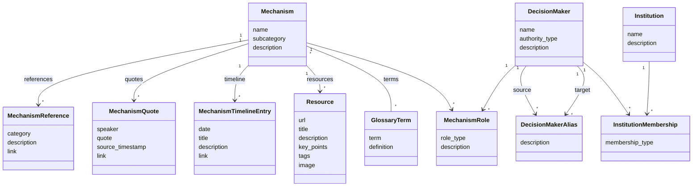

# Data Model

All models inherit from **BaseModel** (UUID primary key, `date_created`, `last_updated`).

```mermaid
classDiagram
    direction TB

    class Mechanism {
        name
        subcategory
        description
    }

    class DecisionMaker {
        name
        authority_type
        description
    }

    class Institution {
        name
        description
    }

    class MechanismRole {
        role_type
        description
    }

    class MechanismReference {
        category
        description
        link
    }

    class MechanismQuote {
        speaker
        quote
        source_timestamp
        link
    }

    class MechanismTimelineEntry {
        date
        title
        description
        link
    }

    class Resource {
        url
        title
        description
        key_points
        tags
        image
    }

    class GlossaryTerm {
        term
        definition
    }

    class DecisionMakerAlias {
        description
    }

    class InstitutionMembership {
        membership_type
    }

    Mechanism "1" --> "*" MechanismReference : references
    Mechanism "1" --> "*" MechanismQuote : quotes
    Mechanism "1" --> "*" MechanismTimelineEntry : timeline
    Mechanism "1" --> "*" Resource : resources
    Mechanism "*" -- "*" GlossaryTerm : terms

    Mechanism "1" --> "*" MechanismRole
    DecisionMaker "1" --> "*" MechanismRole

    DecisionMaker "1" --> "*" DecisionMakerAlias : source
    DecisionMaker "1" --> "*" DecisionMakerAlias : target

    DecisionMaker "1" --> "*" InstitutionMembership
    Institution "1" --> "*" InstitutionMembership
```
